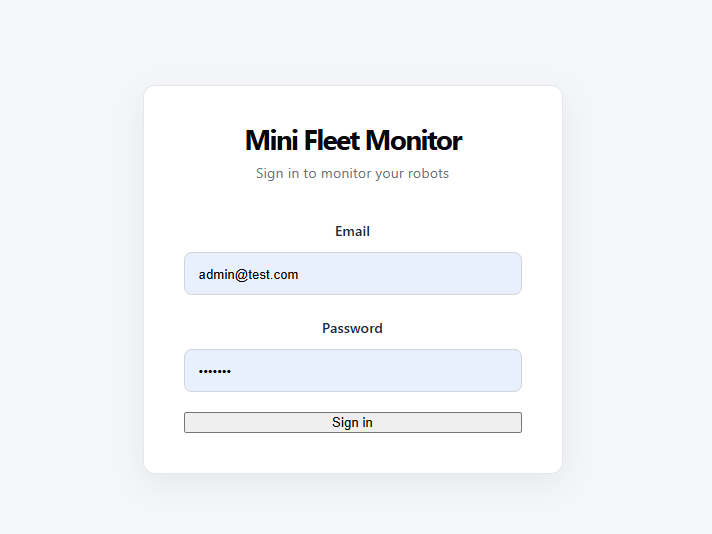
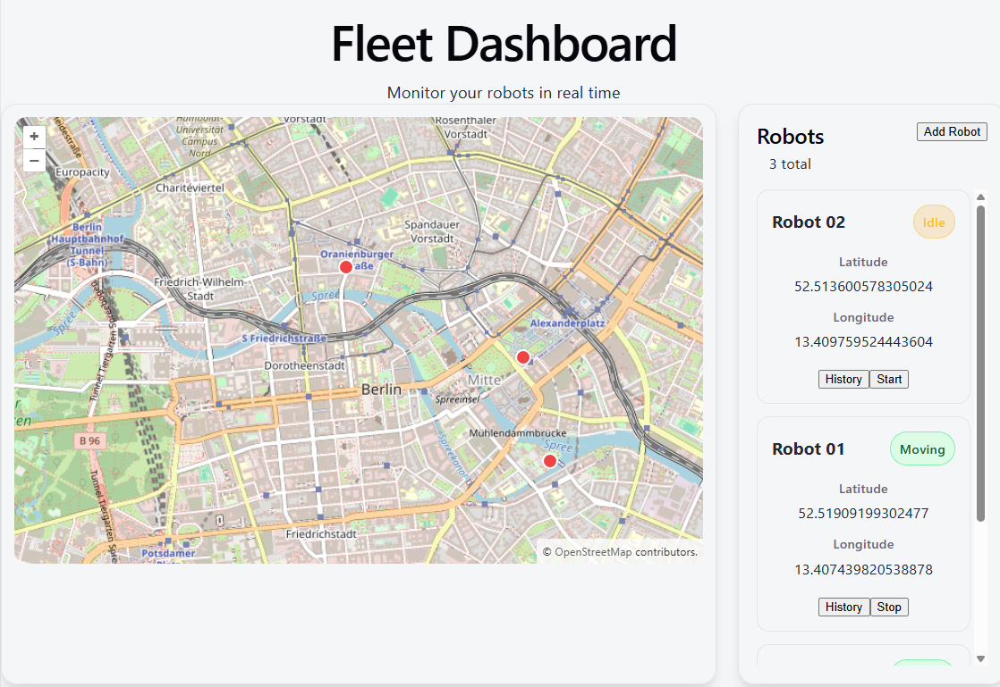
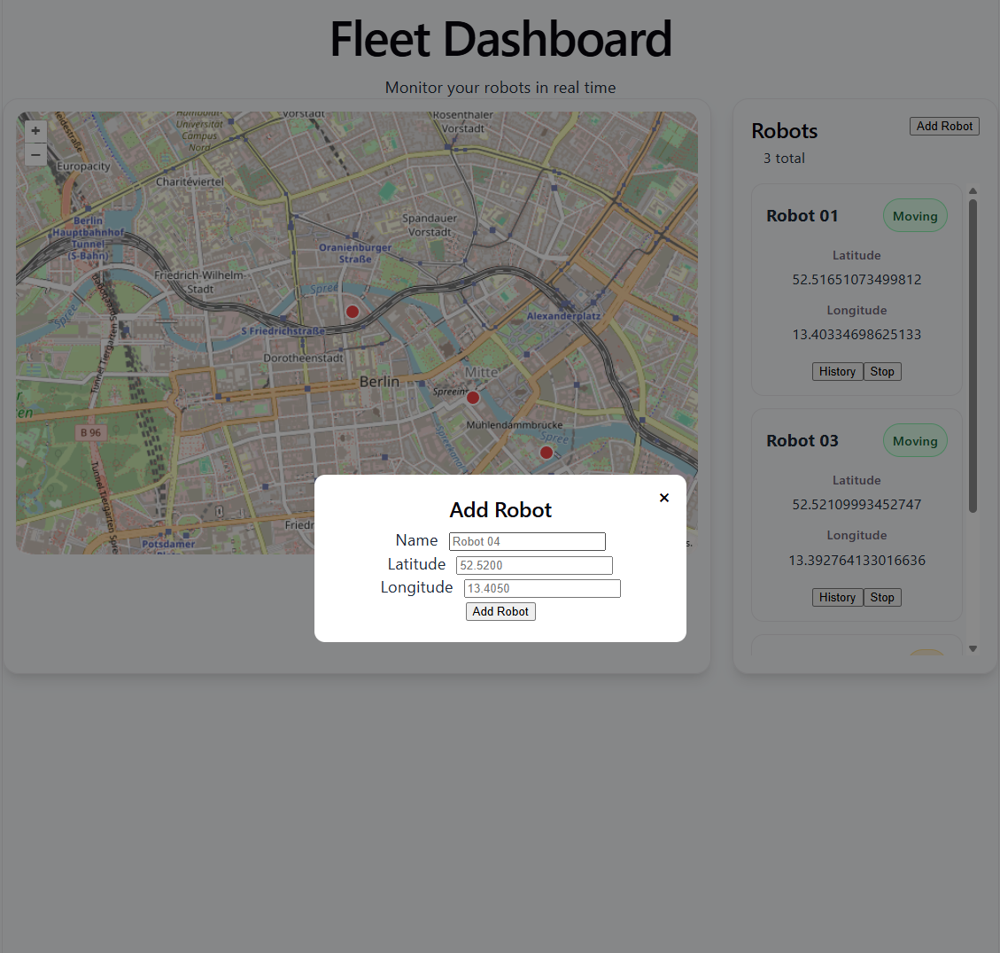
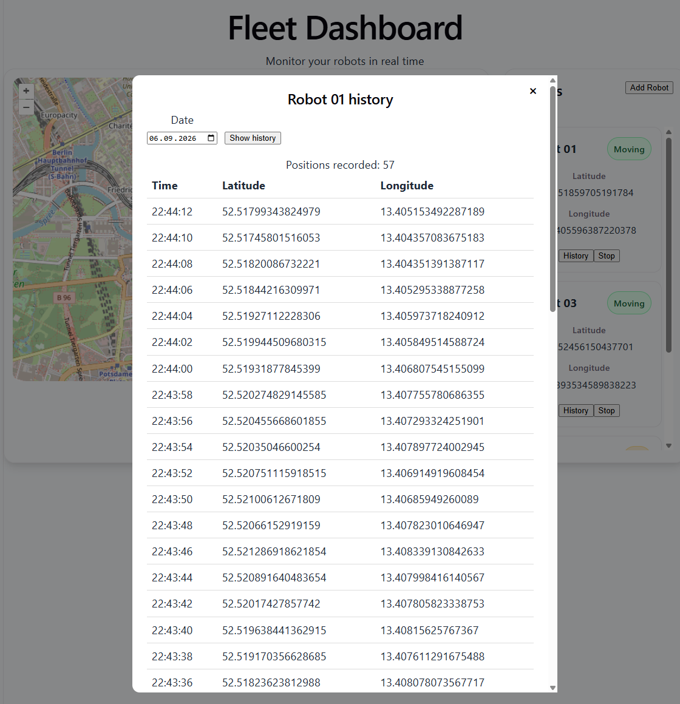

# Mini Fleet Monitor

## Tech Stack

### Backend

- Node.js
- Express
- TypeScript
- Prisma ORM
- PostgreSQL
- Redis
- HTTP mit CORS
- WebSocket (`ws`)
- JWT (`jsonwebtoken`)
- bcryptjs
- Docker Compose

### Frontend

- React
- TypeScript
- Vite
- OpenLayers
- HTML / CSS

## Architecture

PostgreSQL wird als persistenter Datenspeicher für Benutzer, Roboter und die Positionshistorie der Roboter verwendet. Redis dient sowohl als kurzlebiger Cache für GET /robots als auch als Pub/Sub-Schicht für Echtzeit-Updates der Roboterpositionen. Der REST-Endpunkt POST /robots/:id/move löst eine einzelne zufällige Positionsänderung für einen bestimmten Roboter aus. Dieselbe Bewegungslogik wird von einer serverseitigen Simulation alle zwei Sekunden automatisch für Roboter mit dem Status moving verwendet. Die neuen Positionen werden in PostgreSQL gespeichert und anschließend über Redis veröffentlicht. Das Backend abonniert diese Redis-Ereignisse und leitet sie über WebSocket an die verbundenen Frontend-Clients weiter, sodass das React-/OpenLayers-Dashboard die Robotermarker in Echtzeit ohne Polling aktualisieren kann.

## Quick Start

cp .env.example .env

docker compose up --build

Frontend: http://localhost:5173

API: http://localhost:5001

## Demo Credentials

Email: admin@test.com

Password: test123

## API Endpoints

POST /auth/login

GET /robots

POST /robots

POST /robots/:id/move

PATCH /robots/:id/status

GET /robots/:id/positions?date=YYYY-MM-DD

## Screenshots

### Login

### Dashboard

### Add Robot

### History

